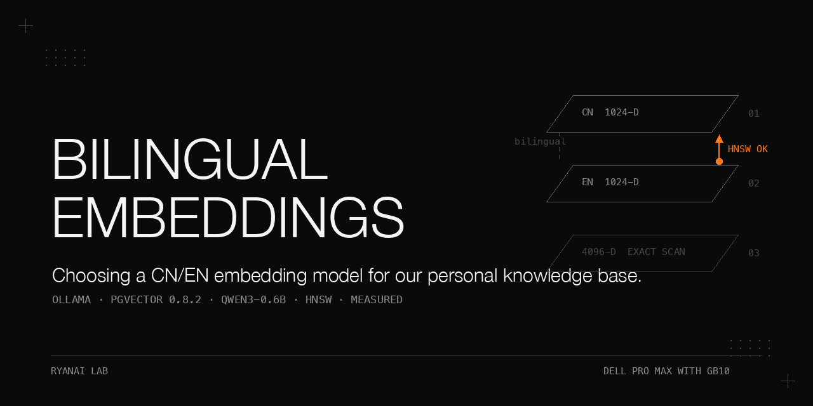

# Bilingual embeddings for a pgvector knowledge base — four candidates, the HNSW limit, and the `num_batch` hazard

> A measured selection of a Chinese/English text-embedding model for our personal knowledge base (~1,700 pages) on Postgres + pgvector, run on one Mac (Apple silicon, local ollama) and two Dell Pro Max with GB10 nodes (head node + worker node, TP2 over RoCE). Four open candidates were scored on Chinese, English, and both cross-lingual directions. `qwen3-embedding:0.6b` won on the combination of Chinese quality and fitting pgvector's HNSW dimension ceiling; `qwen3-8b` scored higher but was disqualified because its vectors exceed the HNSW limit and fall back to exact scan. The actual hidden hazard was not the model choice but an ollama single-batch regression that silently failed large-chunk embeddings until `PARAMETER num_batch 16384` was set. Every number below comes from the source records, with its condition; nothing here is invented.

## Why this matters

A retrieval model that "looks healthy" on short queries can be blind on the exact inputs that matter — long chunks and Chinese text. Two failures here were silent: `nomic` returned a confidently-wrong Chinese match separated from the right one by only 0.033 (indistinguishable from noise), and the ollama `0.30.x` runner returned HTTP 400/EOF on large inputs while short inputs looked fine. Both would have passed a shallow smoke test. The lesson is to assert retrieval quality on real bilingual long-chunk content, not on a held-out toy query, and to treat any asymmetric "short works / long fails" symptom as a batch-limit regression before reaching for config or network explanations.

## Hardware and stack

| | |
|---|---|
| Hardware | 1 Mac (Apple silicon, local ollama) + 2 Dell Pro Max with GB10 (head node + worker node) |
| Store | Postgres with pgvector **0.8.2** — stores vectors up to 16,000 dims, but builds an HNSW index only up to 2,000 dims; a 4,096-dim model therefore runs as an exact scan on this schema (usable, but not indexed) |
| Chosen model | `qwen3-embedding:0.6b` served by ollama |
| Model flag | Modelfile `PARAMETER num_batch 16384` (ollama default is much lower — see crash log below) |
| ollama versions | Mac: 0.30.10 (affected by the regression); Dell Pro Max with GB10 nodes: 0.24.0 and 0.23.4 (tested, not affected) |
| Chinese keyword search | pgroonga 4.0.6 |

The candidates benchmarked are public upstream models: `qwen3-embedding:0.6b`, `qwen3-8b`, `bge-m3`, and `nomic-embed-text` (served via ollama). Our retrieval-quality numbers come from our private 11-category eval bank (questions not published); retrieval quality score on our own query set; metric definition, query count and run count were not recorded, so the scores are reproduced as recorded rather than re-derived.

## Procedure as run

The source records the procedure as a sequence of decisions and verifications, not a single runnable script. The migration and evaluation scripts are not published; where a launch command is not recorded, this cookbook says so rather than inventing one.

1. **Score candidates on bilingual retrieval.** Score the four candidates on Chinese, English, and cross-lingual EN→CN and CN→EN retrieval of the knowledge base (Table 1). The eval set is our private 11-category eval bank (questions not published); the metric definition, query count, and run count are not recorded in the source.
2. **Screen against pgvector constraints.** Any candidate wider than the HNSW index limit (2,000 dims) gets no ANN index and falls back to exact scan. This disqualified `qwen3-8b` (4,096 dims) despite its higher scores.
3. **Choose `qwen3-embedding:0.6b` and migrate the vector column.** Migrate from the nomic schema by NULL-ing the embedding column first, then `ALTER` the column type — a direct `ALTER` on a populated pgvector column fails.
4. **Re-embed existing content.** Re-embed stale content with the `embed --stale` command of the knowledge-base tool (cost in Table 2).
5. **Merge the history-only instance.** Merge a second embedded-database (pglite) instance holding history-only pages; the Postgres page count grows accordingly (Table 2).
6. **Restart the caching process.** Restart whatever long-running process caches the embedding configuration after the embedding-model change — that process reads the model env only at startup.
7. **Verify.** Run the `doctor` integrity check plus a raw pgvector retrieval probe (Table 2).
8. **Apply the batch fix preventively (2026-06-23).** Apply `PARAMETER num_batch 16384` to the embedding model on all three nodes and run the large-input acceptance battery (Tables 3–4).
9. **Install pgroonga for Chinese keyword search.** Plain Postgres FTS returns empty on Chinese; install pgroonga 4.0.6 and split multi-word queries on spaces combined with its OR operator (`&@|`).

> The exact ollama serve command and Modelfile build commands are not recorded in the source; the only recorded flag is `PARAMETER num_batch 16384`. Do not assume a specific port or launch invocation.

## Results

All tables are reproduced verbatim from the source with the measurement condition noted above each. Full tables live in `docs/results.md`.

### Table 1 — four-model comparison

Condition: retrieval quality score on our own query set; metric definition, query count and run count were not recorded. Arrows denote query language → document language.

| Model | Dim | Index | Chinese | English | EN→CN | CN→EN |
|---|---|---|---|---|---|---|
| qwen3-0.6b | 1024 | ✅ HNSW | 0.265 | 0.526 | 0.419 | 0.496 |
| qwen3-8b | 4096 | ❌ exact scan | 0.362 | 0.590 | 0.488 | 0.463 |
| bge-m3 | 1024 | ✅ HNSW | 0.196 | 0.446 | 0.334 | 0.339 |
| nomic | 768 | ✅ HNSW | Chinese queries matched unrelated pages; no numeric score recorded | — | — | — |

### Table 2 — migration cost and verification

Condition: 2026-05-30 migration, single run.

| Measure | Value |
|---|---|
| Re-embed via `embed --stale` | 1619 chunks / 701 pages / ~64 s |
| History-only pages merged from the pglite instance | 518 |
| Postgres page count before → after merge | 1167 → ~1685 |
| `doctor` integrity check | all green: 100% coverage, qwen3 embed 106 ms, width consistency OK |
| Raw pgvector retrieval probe (Chinese query about a corrupted database) | the expected page ranked first with cosine similarity 0.58–0.65 on that query |

### Table 3 — large-input acceptance battery around the `num_batch` fix

Condition: character length of embed input; run on all three nodes (2026-06-23).

| Input | Before fix | After fix |
|---|---|---|
| 6000-char document | ❌ EOF (reproduces the crash) | ✅ |
| 12000-char document | — | ✅ (token count after the fix not recorded) |
| 11500-char input | — | ✅ |
| 13000-char CJK input | — | ✅ (all three nodes) |
| Capture of a unique slug with large CJK content | — | 3/3 `status=created_or_updated` |

### Table 4 — crash mechanism and version attribution

Condition: ollama runner log evidence.

| Item | Value |
|---|---|
| Runner log at failure | `task.n_tokens=2273` → `cached n_tokens=2048` → HTTP 400 |
| Ingestion-side amplifier | the tag/assign code slices document text to 8000 characters before embedding, so even capped inputs crashed |
| Regression scope | ollama **0.30.x** regression; observed on the Mac node running 0.30.10; two other nodes on 0.24.0 / 0.23.4 did not reproduce it; not isolated further |
| Not affected | the two Dell Pro Max with GB10 nodes (0.24.0 and 0.23.4), tested on the large-input battery |

## What did not work

- **nomic on Chinese.** A Chinese question about RAM exhaustion / capacity expansion on a GB10-class server matched an unrelated page on a different topic; a 0.033 similarity gap between the top hits on one query, which we read as no real separation. Chinese retrieval with nomic was effectively blind on that query.
- **qwen3-8b.** Highest Chinese and English scores in Table 1, but its vector width exceeds the pgvector HNSW limit for this schema, so it runs as an exact scan (usable, but not indexed under this fixed dimension and index scheme).
- **Large-chunk embedding (pre-fix).** Any input exceeding the ollama runner's single-batch capacity failed with HTTP 400/EOF while short inputs looked healthy — the asymmetric symptom made it look like a config or network problem.
- **False test failures from the harness.** `tail -3` truncated the "captured:" header and the battery falsely reported 0/3.
- **2026-06-08 regression.** A tool upgrade (version 0.41.18.0) silently reset the embedding-model config entry back to `nomic-embed-text` while the dimensions config entry kept the qwen3 value — the self-contradictory pair broke every raw CLI capture.
- **Incomplete table migration.** The original migration moved only `content_chunks` and `pages`; the `facts` table was missed.
- **Postgres FTS on Chinese.** Full-text keyword search returned empty results for Chinese text until pgroonga was installed.

## Pitfalls

Symptom → root cause → fix, in the order they bear on this cookbook. Expanded with "how we found it" in `docs/pitfalls.md`.

- Long-chunk embed fails with 400/EOF but short inputs pass → ollama runner single-batch limit (0.30.x regression; observed on the Mac node running 0.30.10; two other nodes on 0.24.0 / 0.23.4 did not reproduce it; not isolated further) → set `PARAMETER num_batch 16384` on the embedding model and retest with a large input.
- `ALTER` on the vector column errors → existing vectors are not compatible with the target dimension on a populated column → NULL the embedding column first, then ALTER.
- A recipe/config edit appears to have no effect → the patch silently did not apply → grep the file to confirm every edit landed.
- Old embeddings keep being served after switching models → the process caching the embedding configuration reads the model env only at startup → restart whatever long-running process caches the embedding configuration whenever the embedding model changes.
- `export <path>` writes to the wrong directory → the command ignores its path argument → content always lands in `./export`.
- Retrieval silently degrades after a tool upgrade → the upgrade reset one embedding config key but not its paired dimension key → re-check both embedding config entries after every upgrade and add a guard script.
- Chinese keyword search returns nothing → plain Postgres FTS returned empty on the Chinese queries we ran → install pgroonga and split multi-word queries on spaces, combined with its OR operator (`&@|`).
- Embed failure logs show rotating ephemeral ports → that is the ollama runner subprocess signature, not enough on its own to rule a network or config fault → check token-vs-batch counters in the runner log first.
- Automated battery reports failures that pass manually → harness truncation bug (`tail -3` ate the header line) → stop truncating the output with `tail -3`, parse the full or structured output, and re-read the test slug to verify the write.
- Rows missing in one feature after migration → migration enumerated tables by hand and missed `facts` → diff the full table list before and after, and reconcile per-table row counts and primary keys, not just table names.

## Files

- `README.md` — this cookbook.
- `docs/results.md` — all tables, complete, with measurement conditions.
- `docs/pitfalls.md` — pitfalls expanded with symptom / root cause / fix / how we found it.
- `docs/make_banner.py` — banner generator (pure PIL, house style); produces `docs/assets/banner.png`.
- `docs/assets/banner.png` — generated banner (run `docs/make_banner.py`).

## License

Apache-2.0.
